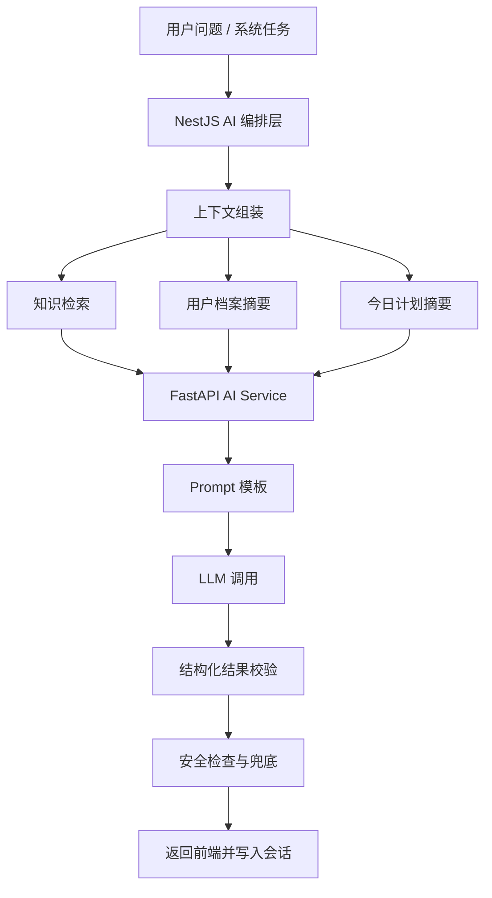

# CampusFit AI AI 架构设计

## 1. AI 设计原则

1. LLM 不负责核心数值计算。
2. 规则引擎输出结构化计划，AI 负责解释与交互。
3. AI 服务必须可降级，不能阻断主业务。
4. AI 输出必须可审计、可回放、可追踪。

## 2. AI 在 MVP 中的职责边界

### 2.1 负责的内容

1. 解释今日饮食与训练安排
2. 回答执行中的常见问题
3. 输出周复盘自然语言总结
4. 根据规则结果生成更友好的表达

### 2.2 不负责的内容

1. 热量、宏量营养、训练组次的核心计算
2. 医疗诊断与疾病建议
3. 高风险减重指导
4. 复杂商品推荐排序

## 3. AI 能力分层

## 4. 组件说明

### 4.1 NestJS AI 编排层

1. 接收前端 AI 请求
2. 校验登录态和上下文
3. 拉取用户档案、今日计划和相关知识
4. 调用 AI Service
5. 处理超时、熔断和缓存

### 4.2 FastAPI AI Service

1. 维护 Prompt 模板
2. 处理上下文拼装
3. 管理模型调用适配器
4. 校验返回结构
5. 记录模型调用指标

### 4.3 知识库层

MVP 建议维护轻量知识库，包括：

1. 饮食替代 FAQ
2. 训练动作注意事项
3. 补剂基础说明
4. 产品适用场景说明

知识库存入：

- `knowledge_documents`
- `knowledge_embeddings`

## 5. AI 场景设计

### 5.1 场景一：计划解释

输入：

1. 用户问题
2. 今日饮食和训练摘要
3. 用户目标和场景

输出：

1. 简明解释
2. 可执行替代建议
3. 风险提醒

### 5.2 场景二：执行问答

典型问题：

1. 没有某个食材怎么替换
2. 没时间训练怎么办
3. 某个动作要注意什么
4. 补剂需不需要买

输出要求：

1. 回答简短
2. 优先给可执行选项
3. 避免空泛鼓励

### 5.3 场景三：周复盘文案增强

规则引擎先产出：

1. 执行率
2. 体重变化
3. 亮点
4. 风险
5. 下周建议

AI 再负责：

1. 将结果整理成易读文案
2. 控制语气为教练式、非说教式

## 6. 模型调用策略

### 6.1 输入策略

1. 限制上下文长度
2. 优先传摘要，不直接传全部原始记录
3. 对今日计划使用结构化 JSON 摘要

### 6.2 输出策略

1. 要求返回 JSON 或固定结构文本
2. 若结构校验失败，进行一次重试
3. 重试仍失败则走兜底文案

### 6.3 兜底策略

1. AI 超时：返回规则侧静态解释
2. AI 被安全策略拦截：返回通用安全提示
3. 检索无结果：只基于用户档案与计划摘要回答

## 7. 安全与合规

1. 禁止输出医疗诊断建议
2. 对极端减脂、未成年人高风险建议进行拦截
3. 对补剂建议统一强调“饮食优先”
4. 保存 AI 消息日志与安全标记

## 8. 性能目标

1. AI 问答接口 P95 小于 6 秒
2. 周复盘文案生成支持异步，避免前台等待过久
3. 高频常见问题允许短时缓存

## 9. 风险点

1. 如果 Prompt 中上下文注入不稳定，AI 易出现与规则结果不一致的描述。
2. 若知识库缺少校园饮食场景内容，回答会偏泛化。
3. 商品与补剂问题容易被模型过度营销化，需明确策略约束。
