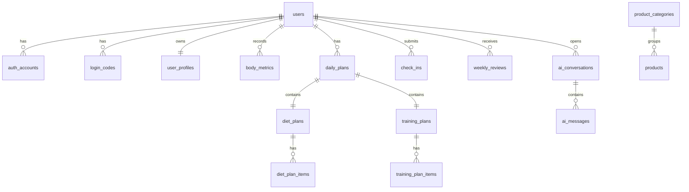

# CampusFit AI 数据库设计

## 1. 设计目标

1. 支撑 MVP 主链路完整运行。
2. 保证计划生成、打卡与复盘可追踪。
3. 为 AI 会话、模板管理和商品管理预留扩展空间。
4. 保持事务数据和向量数据在同一 PostgreSQL 集群内协同。

## 2. 数据库设计原则

1. 用户档案与行为记录分离，避免覆盖历史。
2. 规则生成结果持久化，支持复盘与问题追查。
3. 打卡表尽量轻量，复盘通过聚合生成。
4. 商品与计划解耦，MVP 先支持基础浏览。
5. AI 会话存储用户消息与系统回复，方便审计和上下文复用。

## 3. 核心实体关系

## 4. 表结构定义

### 4.1 `users`

| 字段 | 类型 | 说明 |
| --- | --- | --- |
| id | uuid | 主键 |
| nickname | varchar(64) | 昵称 |
| avatar_url | text | 头像 |
| status | varchar(32) | 状态，默认 active |
| created_at | timestamptz | 创建时间 |
| updated_at | timestamptz | 更新时间 |

### 4.2 `auth_accounts`

| 字段 | 类型 | 说明 |
| --- | --- | --- |
| id | uuid | 主键 |
| user_id | uuid | 关联 `users.id` |
| provider | varchar(32) | `email` |
| provider_user_id | varchar(128) | 邮箱地址 |
| verified_at | timestamptz | 验证通过时间 |
| last_login_at | timestamptz | 最近登录时间 |
| created_at | timestamptz | 创建时间 |
| updated_at | timestamptz | 更新时间 |

唯一约束建议：`provider + provider_user_id`

### 4.3 `login_codes`

| 字段 | 类型 | 说明 |
| --- | --- | --- |
| id | uuid | 主键 |
| email | varchar(128) | 登录邮箱 |
| code_digest | varchar(255) | 验证码摘要，不存明文 |
| expires_at | timestamptz | 失效时间 |
| consumed_at | timestamptz | 使用时间，可空 |
| created_at | timestamptz | 创建时间 |

### 4.4 `user_profiles`

| 字段 | 类型 | 说明 |
| --- | --- | --- |
| id | uuid | 主键 |
| user_id | uuid | 唯一关联 `users.id` |
| gender | varchar(16) | 性别 |
| birth_year | int | 出生年份 |
| height_cm | numeric(5,2) | 身高 |
| current_weight_kg | numeric(5,2) | 当前体重 |
| target_type | varchar(16) | cut / maintain / bulk |
| activity_level | varchar(32) | 日常活动等级 |
| training_experience | varchar(32) | beginner / intermediate |
| training_days_per_week | int | 每周可训练天数 |
| diet_scene | varchar(32) | canteen / dorm / home |
| diet_preferences | jsonb | 偏好标签 |
| diet_restrictions | jsonb | 忌口标签 |
| supplement_opt_in | boolean | 是否接受补剂建议 |
| onboarding_completed_at | timestamptz | 建档完成时间 |
| created_at | timestamptz | 创建时间 |
| updated_at | timestamptz | 更新时间 |

### 4.5 `body_metrics`

| 字段 | 类型 | 说明 |
| --- | --- | --- |
| id | uuid | 主键 |
| user_id | uuid | 关联用户 |
| weight_kg | numeric(5,2) | 体重 |
| body_fat_rate | numeric(5,2) | 体脂率，可空 |
| source | varchar(32) | onboarding / checkin / manual |
| measured_at | timestamptz | 记录时间 |
| created_at | timestamptz | 创建时间 |

### 4.6 `daily_plans`

| 字段 | 类型 | 说明 |
| --- | --- | --- |
| id | uuid | 主键 |
| user_id | uuid | 关联用户 |
| plan_date | date | 计划日期 |
| calorie_target | int | 今日热量目标 |
| protein_target_g | int | 蛋白目标 |
| carb_target_g | int | 碳水目标 |
| fat_target_g | int | 脂肪目标 |
| status | varchar(32) | draft / active / completed |
| generation_source | varchar(32) | rule_engine |
| generation_version | varchar(32) | 规则版本 |
| generated_at | timestamptz | 生成时间 |
| created_at | timestamptz | 创建时间 |
| updated_at | timestamptz | 更新时间 |

唯一约束建议：`user_id + plan_date`

### 4.7 `diet_plans`

| 字段 | 类型 | 说明 |
| --- | --- | --- |
| id | uuid | 主键 |
| daily_plan_id | uuid | 唯一关联 `daily_plans.id` |
| scene | varchar(32) | 饮食场景 |
| summary | text | 当日饮食摘要 |
| supplement_notes | jsonb | 补剂建议摘要 |
| created_at | timestamptz | 创建时间 |
| updated_at | timestamptz | 更新时间 |

### 4.8 `diet_plan_items`

| 字段 | 类型 | 说明 |
| --- | --- | --- |
| id | uuid | 主键 |
| diet_plan_id | uuid | 关联 `diet_plans.id` |
| meal_type | varchar(16) | breakfast / lunch / dinner / snack |
| title | varchar(128) | 餐次标题 |
| target_calories | int | 目标热量 |
| protein_g | int | 蛋白目标 |
| carbs_g | int | 碳水目标 |
| fat_g | int | 脂肪目标 |
| suggestion_text | text | 推荐吃法 |
| alternatives | jsonb | 替代方案 |
| display_order | int | 展示顺序 |
| created_at | timestamptz | 创建时间 |

### 4.9 `training_plans`

| 字段 | 类型 | 说明 |
| --- | --- | --- |
| id | uuid | 主键 |
| daily_plan_id | uuid | 唯一关联 `daily_plans.id` |
| split_type | varchar(32) | full_body / upper_lower / push_pull_legs / rest |
| title | varchar(128) | 今日训练标题 |
| duration_minutes | int | 预计时长 |
| intensity_level | varchar(16) | low / medium / high |
| notes | text | 总说明 |
| created_at | timestamptz | 创建时间 |
| updated_at | timestamptz | 更新时间 |

### 4.10 `training_plan_items`

| 字段 | 类型 | 说明 |
| --- | --- | --- |
| id | uuid | 主键 |
| training_plan_id | uuid | 关联 `training_plans.id` |
| exercise_code | varchar(64) | 动作编码 |
| exercise_name | varchar(128) | 动作名称 |
| sets | int | 组数 |
| reps | varchar(32) | 次数或区间 |
| rest_seconds | int | 休息秒数 |
| notes | text | 注意事项 |
| display_order | int | 展示顺序 |
| created_at | timestamptz | 创建时间 |

### 4.11 `check_ins`

| 字段 | 类型 | 说明 |
| --- | --- | --- |
| id | uuid | 主键 |
| user_id | uuid | 关联用户 |
| daily_plan_id | uuid | 关联 `daily_plans.id` |
| checkin_date | date | 打卡日期 |
| diet_completion_rate | int | 0-100 |
| training_completion_rate | int | 0-100 |
| water_intake_ml | int | 饮水量，可空 |
| step_count | int | 步数，可空 |
| weight_kg | numeric(5,2) | 当日体重，可空 |
| energy_level | int | 1-5 |
| satiety_level | int | 1-5 |
| fatigue_level | int | 1-5 |
| note | text | 备注 |
| created_at | timestamptz | 创建时间 |
| updated_at | timestamptz | 更新时间 |

唯一约束建议：`user_id + checkin_date`

### 4.12 `weekly_reviews`

| 字段 | 类型 | 说明 |
| --- | --- | --- |
| id | uuid | 主键 |
| user_id | uuid | 关联用户 |
| week_start_date | date | 周起始日期 |
| week_end_date | date | 周结束日期 |
| plan_days | int | 计划天数 |
| checked_in_days | int | 打卡天数 |
| avg_diet_completion_rate | int | 平均饮食完成度 |
| avg_training_completion_rate | int | 平均训练完成度 |
| weight_change_kg | numeric(5,2) | 体重变化 |
| highlights | jsonb | 亮点列表 |
| risks | jsonb | 风险列表 |
| recommendations | jsonb | 建议列表 |
| narrative_text | text | AI 增强复盘文案 |
| generation_version | varchar(32) | 复盘规则版本 |
| generated_at | timestamptz | 生成时间 |
| created_at | timestamptz | 创建时间 |

唯一约束建议：`user_id + week_start_date`

### 4.13 `ai_conversations`

| 字段 | 类型 | 说明 |
| --- | --- | --- |
| id | uuid | 主键 |
| user_id | uuid | 关联用户 |
| scenario | varchar(32) | plan_qa / review_qa / general |
| title | varchar(128) | 会话标题 |
| last_message_at | timestamptz | 最后消息时间 |
| created_at | timestamptz | 创建时间 |
| updated_at | timestamptz | 更新时间 |

### 4.14 `ai_messages`

| 字段 | 类型 | 说明 |
| --- | --- | --- |
| id | uuid | 主键 |
| conversation_id | uuid | 关联 `ai_conversations.id` |
| role | varchar(16) | user / assistant / system |
| content | text | 消息内容 |
| prompt_snapshot | jsonb | 提示词摘要，可空 |
| token_usage | jsonb | 模型消耗，可空 |
| latency_ms | int | 耗时，可空 |
| safety_flags | jsonb | 风险标记 |
| created_at | timestamptz | 创建时间 |

### 4.15 `product_categories`

| 字段 | 类型 | 说明 |
| --- | --- | --- |
| id | uuid | 主键 |
| name | varchar(64) | 分类名 |
| slug | varchar(64) | 唯一标识 |
| sort_order | int | 排序 |
| created_at | timestamptz | 创建时间 |
| updated_at | timestamptz | 更新时间 |

### 4.16 `products`

| 字段 | 类型 | 说明 |
| --- | --- | --- |
| id | uuid | 主键 |
| category_id | uuid | 关联 `product_categories.id` |
| name | varchar(128) | 商品名 |
| subtitle | varchar(255) | 副标题 |
| description | text | 描述 |
| target_tags | jsonb | 适用目标标签 |
| scene_tags | jsonb | 适用场景标签 |
| price_cents | int | 展示价格 |
| cover_image_url | text | 封面图 |
| detail_images | jsonb | 详情图 |
| status | varchar(32) | draft / active / inactive |
| sort_order | int | 排序 |
| created_at | timestamptz | 创建时间 |
| updated_at | timestamptz | 更新时间 |

### 4.17 `knowledge_documents`

| 字段 | 类型 | 说明 |
| --- | --- | --- |
| id | uuid | 主键 |
| source_type | varchar(32) | faq / guide / policy |
| title | varchar(255) | 标题 |
| content | text | 原文 |
| metadata | jsonb | 元数据 |
| created_at | timestamptz | 创建时间 |
| updated_at | timestamptz | 更新时间 |

### 4.18 `knowledge_embeddings`

| 字段 | 类型 | 说明 |
| --- | --- | --- |
| id | uuid | 主键 |
| document_id | uuid | 关联 `knowledge_documents.id` |
| chunk_text | text | 分块文本 |
| embedding | vector | 向量字段 |
| metadata | jsonb | 元数据 |
| created_at | timestamptz | 创建时间 |

## 5. 索引建议

1. `daily_plans(user_id, plan_date)` 唯一索引
2. `check_ins(user_id, checkin_date)` 唯一索引
3. `weekly_reviews(user_id, week_start_date)` 唯一索引
4. `products(status, sort_order)` 普通索引
5. `ai_messages(conversation_id, created_at)` 普通索引
6. `knowledge_embeddings` 使用向量索引

## 6. 数据一致性约束

1. 所有计划必须依附于 `daily_plans`。
2. 打卡必须绑定到当日计划，避免游离数据。
3. 周复盘来源于打卡聚合，不能手工伪造最终值。
4. AI 问答记录必须保存会话和消息，便于追踪输出来源。

## 7. 迁移与扩展建议

1. Prisma 管理常规表结构。
2. `pgvector` 扩展与向量表迁移可通过 SQL migration 管理。
3. 若后续接入订单系统，可新增 `orders`、`order_items`、`payment_records`，不影响当前主链路。
