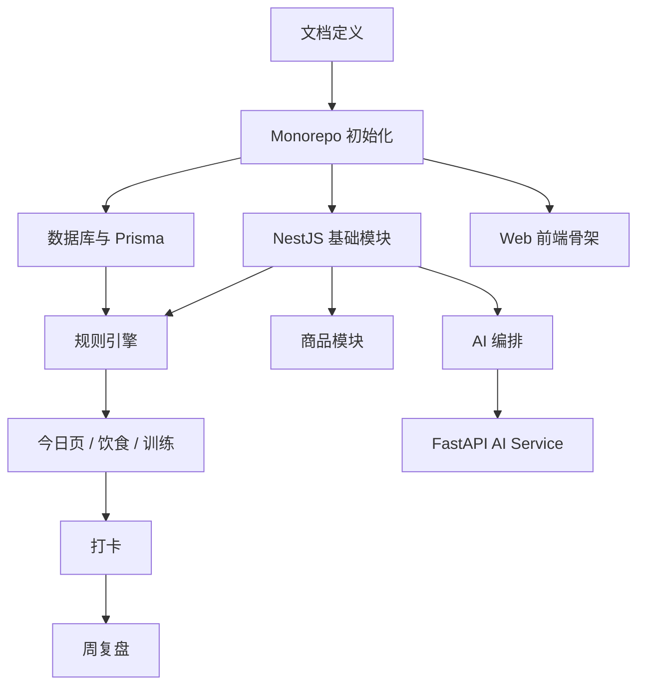

# CampusFit AI 实施路线图

## 1. 路线图目标

以“先文档、再工程基础、再网页 MVP 主链路”的方式推进，降低返工和架构失控风险。

## 2. 阶段划分

## 阶段一：文档定义

### 目标

统一产品、技术、数据、接口和 AI 方案。

### 输出物

1. 产品概览
2. MVP PRD
3. 用户故事
4. 页面树
5. 系统架构
6. 仓库结构
7. 数据库设计
8. API 设计
9. AI 架构
10. Prompt 策略
11. 实施路线图
12. 验收标准
13. 假设记录
14. 决策记录
15. 进度记录

### 完成标志

1. 文档之间术语一致
2. 核心接口与数据库一致
3. MVP 范围和非范围明确

## 阶段二：初始化仓库

### 目标

搭建 Monorepo 工程基础，做到多应用可启动、公共配置统一。

### 关键任务

1. 初始化 `pnpm + Turborepo`
2. 创建 `apps/`、`services/`、`packages/` 基础结构
3. 建立 README
4. 建立 `.env.example`
5. 建立 lint / test / format 配置
6. 建立 Next.js Web、Next.js Admin、NestJS、FastAPI 工程骨架

### 验收标志

1. 关键应用可本地启动
2. 根命令可统一执行 lint / test / build
3. 环境变量模板齐全

## 阶段三：实现网页 MVP 主链路

### 目标

打通登录建档、今日计划、打卡、周复盘、AI 助手、商品列表。

### 关键任务

1. 邮箱验证码登录与建档
2. 今日页
3. 饮食计划生成
4. 训练计划生成
5. 打卡记录
6. 周复盘
7. 基础 AI 问答助手
8. 基础商品列表

### 验收标志

1. 今日页主链路可运行
2. 数据库与接口对齐
3. 页面具备 loading / empty / error 状态
4. 测试覆盖关键流程
5. 桌面和移动浏览器均可使用

## 3. 推荐执行顺序

1. 完成文档并冻结 MVP 范围
2. 初始化仓库与基础配置
3. 先建数据库与后端骨架
4. 再做网页页面和 API 联调
5. 最后接入 AI 服务和商品列表

## 4. 模块依赖关系

## 5. 里程碑建议

### 里程碑 M1：文档冻结

- 输出全部基础文档
- 明确范围与关键决策

### 里程碑 M2：工程基础可运行

- Monorepo 各应用骨架可启动
- CI 基础能力就绪

### 里程碑 M3：规则主链路跑通

- 登录建档
- 今日计划
- 打卡

### 里程碑 M4：AI 与商品接入

- AI 问答
- 周复盘文案增强
- 商品列表

### 里程碑 M5：网页 MVP 验收

- 核心路径测试通过
- 响应式适配达标
- 错误兜底完整

## 6. 风险与应对

| 风险 | 影响 | 应对方案 |
| --- | --- | --- |
| 邮箱登录联调晚于预期 | 阻塞主链路 | 本地开发阶段提供 mock 登录策略 |
| 规则引擎定义不稳定 | 数据模型与接口反复修改 | 先冻结规则输出结构，再实现 |
| AI 延迟高 | 影响用户体验 | AI 单独超时兜底，不阻塞今日页 |
| 响应式设计不足 | 移动浏览器体验差 | 早期就纳入移动浏览器验收 |
| pgvector 与 Prisma 迁移复杂 | 数据层不稳定 | 常规表用 Prisma，向量相关用 SQL migration |

## 7. 下一阶段建议

1. 根目录 Monorepo 与包管理初始化
2. `apps/api` + PostgreSQL + Prisma
3. `apps/web`
4. `packages/rule-engine`
5. `services/ai-service`
6. `apps/admin`
