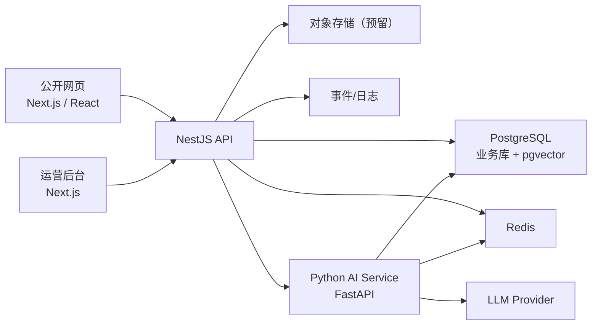

# CampusFit AI 系统架构

## 1. 架构目标

1. 支撑网页 MVP 主链路快速落地。
2. 保证规则计算稳定、可测试、可追踪。
3. 为后续后台和更复杂 AI 能力预留扩展空间。
4. 避免把核心业务耦合到单一模型能力中。

## 2. 总体架构原则

1. 前后端分层清晰，前端不承担核心业务规则。
2. 业务计算以 NestJS 为主控层，AI 服务作为独立能力层。
3. 事务数据与向量数据尽量共用同一 PostgreSQL 集群，降低运维复杂度。
4. Redis 负责缓存、短期会话和异步任务协同。
5. 先模块化单体，后续再按负载拆分服务。

## 3. 架构总览

## 4. 分层说明

### 4.1 客户端层

- 公开网页：主承载 MVP 用户场景，支持桌面与移动浏览器。
- 运营后台：管理模板、商品、内容与基础数据。

### 4.2 应用服务层

#### NestJS API

1. 认证鉴权
2. 用户档案管理
3. 规则引擎调用与计划生成
4. 打卡记录和复盘数据聚合
5. 商品列表接口
6. AI 服务编排
7. 审计日志和埋点输出

#### Python AI Service

1. Prompt 编排
2. 检索与上下文拼装
3. LLM 调用与结果结构化
4. AI 问答、计划解释、周复盘文案增强

### 4.3 数据层

#### PostgreSQL

用于保存用户档案、计划结果、打卡、复盘、商品、AI 会话和向量检索数据。

#### Redis

用于保存登录态缓存、今日页聚合缓存、模型响应短期缓存、异步任务状态和限流计数。

## 5. 核心模块设计

### 5.1 认证模块

- 邮箱验证码登录
- 颁发 access token / refresh token
- MVP 先不做复杂第三方登录聚合

### 5.2 用户档案模块

- 管理身体数据、目标、饮食偏好、训练偏好
- 作为计划生成统一输入

### 5.3 规则引擎模块

1. 计算热量与宏量营养目标
2. 匹配饮食场景模板
3. 生成训练分化与动作安排
4. 输出结构化计划 JSON

约束：

- 规则结果必须可复现
- 计算公式和版本必须可追踪

### 5.4 今日计划模块

- 聚合今日饮食计划、训练计划、打卡状态和商品入口
- 提供单接口聚合输出

### 5.5 打卡与复盘模块

- 记录每日执行数据
- 每周按固定时间窗汇总趋势
- 支持规则汇总 + AI 文案增强

### 5.6 商品模块

- 基础商品分类、标签、适用目标维护
- 支持列表、详情、上下架

### 5.7 AI 模块

- 非核心计算模块
- 提供问答、解释、复盘话术增强
- 失败不阻塞主业务

## 6. 关键业务流

### 6.1 首次建档

1. 网页发起邮箱验证码登录。
2. NestJS 创建或关联用户。
3. 用户提交建档信息。
4. 规则引擎计算初始目标。
5. 生成今日饮食计划与训练计划。
6. 返回今日页所需数据。

### 6.2 今日页访问

1. 前端请求今日页聚合接口。
2. API 先查缓存，再查数据库。
3. 若计划不存在，则触发实时生成。
4. 返回计划摘要、打卡状态、周复盘提示和商品入口。

### 6.3 AI 问答

1. 前端发送问题。
2. NestJS 校验用户与上下文。
3. AI Service 获取档案摘要、今日计划摘要和知识片段。
4. 组装 Prompt 并调用模型。
5. 结构化响应后回写消息记录。

## 7. 部署建议

1. 公开网页与后台由 Next.js 构建产出。
2. NestJS 与 AI Service 独立容器部署。
3. PostgreSQL 与 Redis 采用托管或单独实例。
4. Web 前端通过 HTTPS 访问 API 和 AI 编排入口。

## 8. 可观测性设计

1. API 请求日志
2. 关键业务事件埋点
3. 计划生成耗时统计
4. AI 调用耗时、成功率、兜底率
5. 异常告警和审计日志

## 9. 安全设计

1. 敏感字段最小化存储
2. Token 鉴权 + 接口限流
3. AI 输入输出审查与敏感词过滤
4. 管理端 RBAC 权限控制
5. 审计日志保留关键配置变更记录

## 10. 架构风险

1. 规则引擎与 AI 输出边界不清会造成结果漂移。
2. 今日页如果依赖多次接口串联，首屏性能会恶化。
3. pgvector 与 Prisma 混用需要提前约束迁移方案。
4. 登录、响应式适配和多浏览器兼容需要统一验收口径。
